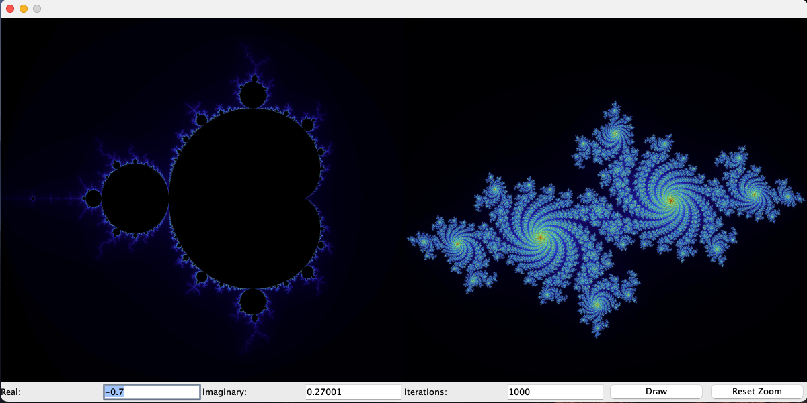

## Julia Set Explorer

This is a simple program that allows you to explore the Julia set. The Julia set is a fractal that is generated by iterating a function of the form $f(z) = z^2 + c$, where c and z are complex numbers. The program allows you to change the value of c and see how the Julia set changes. You can either manually enter a complex number or click on the image of the Mandlebrot Set (The one on the left) to select a point from the complex plane. Then click the draw button to see the Julia set for that value of c (this may take a few seconds to draw). The more intresting images come from points that are near the boundary of the Mandlebrot Set. In addition you can change the number of iterations used to generate the image. This will likely change the color of the image a bit as well because the RGB values are based on the number of iterations it takes a point to diverge. For images that appear too dark you can lower the iterations and for images that are too unrefined you can increase the number of iterations.

Once the Julia Set image has been drawn you can zoom by clicking and dragging over the Julia Set image. There is a certain limit to the zoom and once this is reached it will prohibit you from zooming further. You can also reset the image to the original view by clicking the reset button. It is a pretty simple and intuitive program to use I think.

#### How to run the program
To run the program you need to run the main function of JuilaSetViewer.java. This is will create an open the GUI.

## How I made it
I split different aspects of the Julia Set Viewer into different classes. There are 5 classes:
- ComplexNumber: This class represents a complex number and has methods for adding, subtracting, multiplying, and dividing complex numbers. It also has a method for calculating the magnitude of a complex number. This class is used for the basic arithmetic operations needed to calculate the Julia Set.
- JuliaSet: This class represents the Julia Set and has methods and an instance of this class corresponds to a single image of the Julia Set for a given complex number. This method takes a complex number and using mulitithreading computes the image of the Julia Set for that complex number.
- Plotter: This class is uses Java's AWT and Swing libraries to plot the Julia Set image. It has methods for drawing the image, zooming in on the image, and resetting the image. It extends JPanel and overrides the paintComponent method to draw the image. (It was what you see on the right half of the GUI)
- Mandlebort: This class similiarly extends JPanel and calculates and draws the Mandlebrot Set. It has a method for selecting a point on the Mandlebrot Set and then passing that point to the JuliaSet class to draw the corresponding Julia Set image. (It was what you see on the left half of the GUI)
- JuliaSetViewer: This class is the main class and creates the GUI. It has a main method that creates the GUI and adds the Mandlebrot and Julia Set images to the GUI. It also has a method for updating the Julia Set image when a new complex number is selected and drawn.